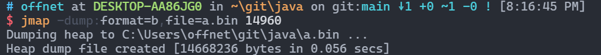

- [工具概况](#工具概况)
- [详细介绍](#详细介绍)
  - [jps(虚拟机进程状况工具)](#jps虚拟机进程状况工具)
  - [jstat(虚拟机统计信息监视工具)](#jstat虚拟机统计信息监视工具)
  - [jinfo(java配置信息工具)](#jinfojava配置信息工具)
  - [jmap(java内存映像工具)](#jmapjava内存映像工具)
  - [jhat(用于分析dump)](#jhat用于分析dump)
  - [jstack(Java堆栈跟踪工具)](#jstackjava堆栈跟踪工具)

# Java Profiling in Terminal
> java命令行性能检测

## 工具概况
1. 命令行工具

|  命令  |              全称              |                                     功能                                      |
|:------:|:------------------------------:|:---------------------------------------------------------------------------:|
|  jps   |    JVM Process Status Tool     |                        显示系统中所有HotSpot虚拟机进程                        |
| jstat  | JVM Statistics Monitoring Tool |                          收集虚拟机各方面的运行数据                           |
| jinfo  |  Configuration Info for Java   |                              显示虚拟机配置信息                               |
|  jmap  |      Memory Map for Java       |                     生成虚拟机内存转储快照(heapdump)文件                      |
|  jhat  |     JVM Heap Dump Browser      | 用于分析heapdump文件，建立一个http/html服务器，让用户可以在浏览器上查看分析结果 |
| jstack |      Stack Trace for Java      |                             显示虚拟机的线程快照                              |

2. GUI工具

* JConsole(JAVA监视与管理控制台)

* VisualVM(多合一故障处理工具)

## 详细介绍
### jps(虚拟机进程状况工具)
1. 命令格式： jps -[op] [hostid]
2. op的功能

| op |          功能           |
|:--:|:---------------------:|
| l  |      输出主类全名       |
| q  | 只显示进程id，不显示类名 |
| m  |    显示main函数参数     |
| v  | 显示虚拟机启动时JVM参数 |

3. 具体实例

### jstat(虚拟机统计信息监视工具)
1. 命令格式  
 `jstat -<option> [-t] [-h<lines>] <vmid> [<interval> [<count>]]`

2. 常见op及其功能

|op|功能|
|:--:|:--:|
|gc| 监视java堆状况，包括eden区，两个survivor区，老年代，永久代等的容量|
|gcutil|gc的统计信息，即各个区已使用的百分比|

> java堆内存布局 
> 

3. 结果各项数据意义

|       项        |                     意义                      |
|:---------------:|:-------------------------------------------:|
| S0C,S1C,S0U,S1U | Survivor 0/1区的容量(capacity)与使用量(usage) |
|      EC,EU      |              Eden的区容量与用量               |
|      OC,OU      |             年老代的区容量与用量              |
|      PC,PU      |             永久代的区容量与用量              |
|     YGC,YGT     |            年轻代的gc次数与gc耗时             |
|     FGC,FGT     |             Full的gc次数与gc耗时              |
|       GCT       |                   gc总耗时                    |

4. 例子

### jinfo(java配置信息工具)
1. 命令格式： `jinfo <option> <pid>`

2. 功能：

|          op           |                     功能                     |
|:---------------------:|:--------------------------------------------:|
|    `flag <name> `     |   to print the value of the named VM flag    |
|  `flag [+\|-]<name>`   |    to enable or disable the named VM flag    |
| `flag <name>=<value>` | to set the named VM flag to the given value  |
| `flags              ` |              to print VM flags               |
| `sysprops           ` |       to print Java system properties        |
| `<no option>        ` | to print both VM flags and system properties |

3. 例子

### jmap(java内存映像工具)
1. 简介
   > * jmap用于生成堆内存快照，即heapdump或dump文件
   > * 除此之外还可以用来查询类加载器finalizer队列信息

2. 命令格式
   * `jamp -op1 vmid`
   * `jmap -dump:-op2 vmid`
   * `jmap -histo:-op3 vmid`
3. 功能

|       op1        |                         功能                          |
|:----------------:|:---------------------------------------------------:|
| `    clstats  `  |                   显示类加载器信息                    |
| ` finalizerinfo` | 显示在F-Queue等待Finalizer线程执行finalizer方法的对象 |

|   dump:op2    |                                       功能                                       |
|:-------------:|:--------------------------------------------------------------------------------:|
| `   live    ` |                              dump only live objects                              |
| `    all    ` | dump all objects in the heap (default if one of "live" or "all" is not specified |
| ` format=b  ` |                                  binary format                                   |
| `file=<file>` |                               dump heap to `<file>`                                |

|   histo:op3   |                                        功能                                        |
|:-------------:|:----------------------------------------------------------------------------------:|
|    `live`     |                              count only live objects                               |
|     `all`     | count all objects in the heap (default if one of "live" or "all" is not specified) |
| `file=<file>` |                                dump data to`<file>`                                 |

4. 例子

### jhat(用于分析dump)

这个东西已经亡了，不在集成

### jstack(Java堆栈跟踪工具)

1. 命令格式：`jstack -op vmid`

2. 功能

| op |                  功能                   |
|:--:|:-------------------------------------:|
| l  |    long listing:显示关于锁的附加信息    |
| e  | extended listing:显示关于线程的附加信息 |

3. 例子
  
  